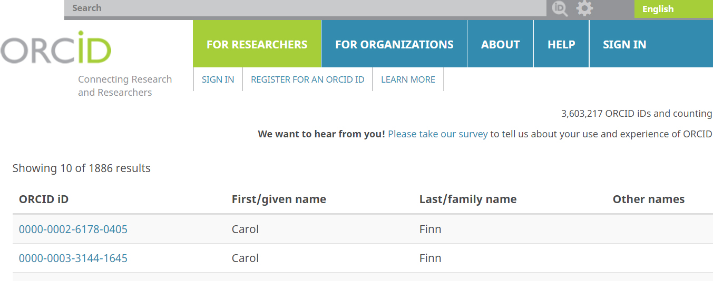

#  Getting Started with OrCiD
25 Minutes

---

## Learning Objectives

* Register for an ORCiD account and activate it (or look up an existing ORCiD)
* Logon to ORCiD and account and populate basic account fields
* Apply desired privacy settings
* Set up a delegate to assist with maintaining account

---
To our loved ones, we are unique in the world, but when it comes to our names on the vast scholarly web, that is not the case! Names are not the best unique identifiers for us as authors because they can be identifical or similar enough that a computer can not tell us apart. Additionally, our names may change over time due to life events; or they may be represented in different ways depending on translation or transliteration. 

These circumstances mean that, on the web of data, we face name confusion challenges. We may be associated with work we did not create; someone else may get credit for our contributions; or an institution such as a publisher, funding agency, or university may not be able to validate who is responsible for a work. For all these reasons, the scholarly web works better when each of us as researchers has a unique, persistent identifier. Just as DOI's pinpoint an exact research contribution, an Online Contributor Researcher ID (ORCiD, pronounced like the lovely flower) creates a unique, persistent identifier for an individual researcher.

The illustration below demonstrates that there are two researchers with the same name. Clicking on each of their ORCiD profiles reflects that they even work for the same agency in the same state!  If not for their unique ORCiD's, these two highly productive researchers could be easily confused by both humans and computers. 

---

### Exercise 1A. Create your own ORCiD

After watching a demo of the ORCiD system and viewing a researcher's ORCiD 
profile, register for your own ORCiD using their quick and easy form.

Point your web browser to http://orcid.org and follow the directions to 
register for a new ORCiD. Wait for the confirmation email from ORCiD to 
arrive in your email inbox and click on the link it contains to establish 
your own unique 16-digit Researcher ID -- like a DOI but for people.

---

**Welcome to the global scholarly web where you get credit for all your work
and contributions using ORCiD; no one claims your works as their own; and
colleagues don't get confused whether a given research work is yours or
someone's with a similar or same name!**

Next: [Adding Works](01-adding-works.html)
