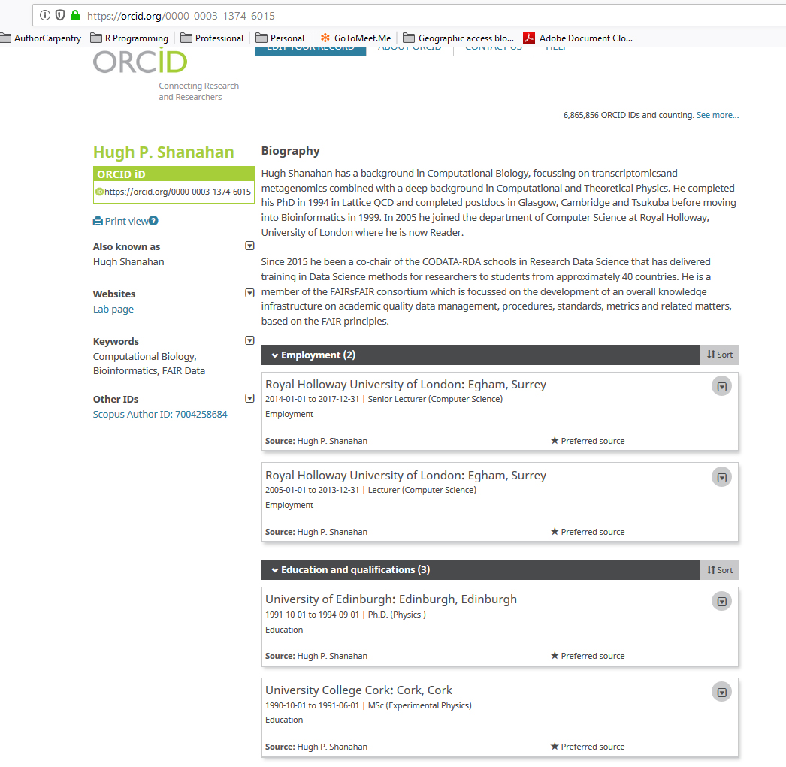
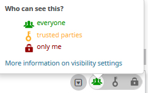

#  Getting Started with ORCID
25 Minutes

---

## Learning Objectives

* Register for an ORCID account and activate it (or look up an existing ORCID)
* Sign in to your ORCID account and edit your profile by populating basic account fields
* Recognize the three  privacy settings that ORCID supports and apply the desired setting to the data in your ORCID profile

-----

## Introduction

The scholarly web is exploding in size and complexity as more research outputs are published online across a plethora of platforms using a diversity of filetypes and formats. 

|According to the International Association of STM Publishers: |
| -------------------------------------------------------------|
| "In 2018 there were about 42,500 active peer reviewed journals publishing about 3 million articles a year."|
| "The number of articles published each year and the number of journals have both grown steadily for over two centuries, by about 3% and 3.5% per year respectively. However, growth has accelerated to 4% per year for articles and over 5% for journals in recent years."|  
| "The reason is the continued growth in research and development expenditure, and the rising number of researchers, which now stands at between 7 and 8 million, depending on definition, although only about 20% of these are repeat authors."| 
| "Around one third of the scientific/technical literature is available legally and freely via Open Access."|
| "China is now the pre-eminent producer of papers globally (19%) surpassing the US (18%)" 
| Source:<https://www.stm-assoc.org/2018_10_04_STM_Report_2018.pdf>

These circumstances mean that, on the scholarly web, both people and machines can get confused about author identity and might mistakenly attribute one author's works to another author with a similar name. Conversely, an author whose name changes over time may fail to receive credit for all of his or her works. An institution such as a publisher, funding agency, or university 
may not be able to validate who is responsible for a work.

For all these reasons, the scholarly web works better when each researcher has a unique, persistent identifier that humans and machines can understand. Just as a Digital Object identifier (DOI) pinpoints an exact research contribution, an Online Contributor Researcher ID (ORCID, pronounced like the lovely flower) pinpoints an individual researcher.

---

### Exercise 1. Create your own ORCID

Point your web browser to [http://orcid.org](http://orcid.org) and follow the directions to register for a new ORCID. Wait for the confirmation email from ORCID to arrive in your email inbox and click on the link it contains to establish your own unique 16-digit Researcher ID.

If you already have an ORCID but don't remember the number and password, please consult the ORCID help page at <https://support.orcid.org/knowledgebase/articles/895944-how-do-you-check-for-duplicate-orcid-records>. If you end up with two ORCID accounts, you can work with ORCID tech support to merge them per the instructions at <https://orcid.org/blog/2017/03/15/new-feature-alert>.

### Exercise 2: Review another ORCID profile to see how data is displayed

 
After creating an ORCID and validating your e-mail address, you'll have
access to edit and extend your ORCID profile. You'll notice that your ORCID profile includes areas for you to enter CV-like data. You can enter as much or as little as you like: depending on your privacy settings, this information is what other people or
computer systems will see when they look up your ORCID.

Refer to the illustration below for an example of Hugh Shanahan's ORCID profile showing data that has been added to basic fields and set to display openly to the world.

----

#### Exercise 3a.

Click on the link for 'My ORCID Record' in the top of the ORCID page to edit your profile. 
* Add an alternate name in the "also known as" field; 
* Compose a brief biography in the "Biography"" field; 
* Add one or more entries into the "Education" and "Employment" sections. 

#### Exercise 3b.

Set the privacy settings for each data field you completed in your ORCID profile, using the illustration below as a guide.

* everyone = this data is visible to everyone around the world with Web access
* trusted parties = data with this setting are visible and editable to trusted third parties for whom you grant permission 
* only me = the data is visible to you only when you are logged in to your ORCId account

**Note that your preferred name and ORCID number are always set to 'everyone' as an ORCID policy.**

-----

Welcome to the global scholarly web where, thanks to ORCID,

- You get credit for all your work and contributions 
- No one claims your work as their own
- Publishers, funders, and colleagues don't get confused whether a given research work is yours or someone's with a similar or same name!
- You are able to comply with Publisher, Funder, or Institutional mandates that require you to provide an ORCID number in their systems. 
- For example, the United States National Institutes of Health (NIH) now requires all proposal authors to include their ORCID in their applications. See the July 19, 2019 [NIH notice](https://grants.nih.gov/grants/guide/notice-files/NOT-OD-19-109.html) for details. 
- Related links
    + Publishers that require author ORCIDs are listed at <https://orcid.org/content/requiring-orcid-publication-workflows-open-letter>
    + Funders with ORCID policies are listed at <https://orcid.org/organizations/funders/policies>
    + Institutions that have integrated ORCID are listed at <https://orcid.org/members> 

Next: [Adding Works](01-adding-works.html)
