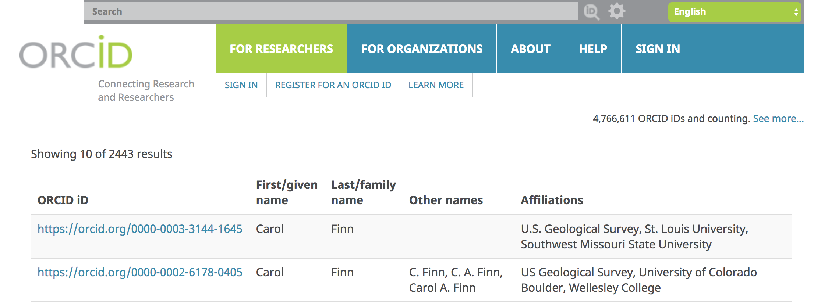

#  Getting Started with ORCID
25 Minutes

---

## Learning Objectives

* Register for an ORCID account and activate it (or look up an existing ORCID iD)
* Log on to your ORCID account and populate (at a  minimum) the Biography
* Make sure the Biography section is set for public view so it can be harvested by another service (eg, a reproducible report)

---
To our loved ones, we are unique in the world, but when it comes to our names on the vast scholarly web, that is not the case! Names are not the best unique identifiers for us as authors because they can be identifical or similar enough that a computer can not tell us apart. Additionally, our names may change over time due to life events; or they may be represented in different ways depending on translation or transliteration. 

These circumstances mean that, on the web of data, we face name confusion challenges. 
We may be associated with work we did not create; someone else may get credit for our 
contributions; or an institution such as a publisher, funding agency, or university 
may not be able to validate who is responsible for a work. For all these reasons, 
the scholarly web works better when each of us as researchers has a unique, 
persistent identifier. Just as DOI's pinpoint an exact research contribution, an 
Online Contributor Researcher ID (ORCID iD, pronounced like the lovely flower) 
creates a unique, persistent identifier for an individual researcher.

Check out these two ORCID profiles: [Carol
Finn](https://orcid.org/0000-0003-3144-1645) and [Carol
Finn](https://orcid.org/0000-0002-6178-0405)

These two researchers have the same name. Looking at their employment they even work for the same 
agency in the same state!  If not for their unique ORCIDs, these two highly productive 
researchers could be easily confused by both humans and computers. 

---

### Exercise 1. Create your own ORCID

Point your web browser to http://orcid.org and follow the directions to register for a new ORCID. Wait for the confirmation email from ORCID to arrive in your email inbox and click on the link it contains to establish your own unique 16-digit Researcher ID -- like a DOI but for people.

If you already have an ORCID but don't remember the number and password, please consult the ORCID help page at <https://support.orcid.org/knowledgebase/articles/895944-how-do-you-check-for-duplicate-orcid-records>. If you end up with two ORCID accounts, you can work with ORCID tech support to merge them per the instructions at <https://orcid.org/blog/2017/03/15/new-feature-alert>.

### Exercise 2. Add a Biography to your ORCID profile for use in other trusted Web services

When you log into your ORCID account, you will land on your profile page <https://orcid.org/my-orcid> with buttons enabling you to add new data or edit existing data.

Write a brief biography and make sure to set it to public view, as shown in the screen shot below.

---

Welcome to the global scholarly web where, thanks to ORCID:

- You get credit for all your work and contributions 
- No one claims your works as their own
- Publishers, Funders, and Colleagues don't get confused whether a given research work is yours or someone's with a similar or same name!
- You are able to comply with Publisher, Funder, or Institutional mandates that require you to provide an ORCID number in their systems 
    + Publishers that require author ORCIDs are listed at <https://orcid.org/content/requiring-orcid-publication-workflows-open-letter>
    + Funders with ORCID policies are listed at <https://orcid.org/organizations/funders/policies>
    + Institutions that have integrated ORCID are listed at <https://orcid.org/members> 

Next: [Adding Works](01-adding-works.html)
